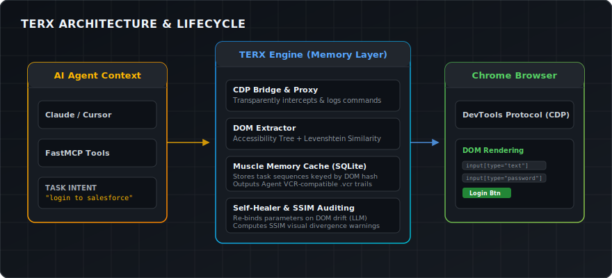

<div align="center">

# ⚡ TERX

### Memory layer for browser agents.
**Your agent logs into Salesforce 50 times a day. TERX makes runs 2–50 cost zero tokens.**

<br>
<a href="https://github.com/ixchio/terx/actions/workflows/tests.yml"></a>
<a href="https://pypi.org/project/terx/"></a>
<a href="https://opensource.org/licenses/MIT"></a>
<a href="https://www.python.org/downloads/"></a>
<a href="https://github.com/ixchio/agent-vcr"></a>
<br><br>

```bash
pip install terx
```

No Playwright. No Selenium. Raw CDP. Works with Agent VCR.

<br>

</div>

---

## The Problem

Every browser agent today is amnesiac.

Run your agent 50 times on the same login flow. It re-discovers the login button all 50 times.
Burns LLM tokens re-discovering the login button all 50 times.

```
Run 1:  LLM finds login button → clicks → succeeds   [$0.008 · 2,100 tokens · 3.2s]
Run 2:  LLM finds login button → clicks → succeeds   [$0.008 · 2,100 tokens · 3.1s]
Run 3:  LLM finds login button → clicks → succeeds   [$0.008 · 2,100 tokens · 3.3s]
...
Run 50: LLM finds login button → clicks → succeeds   [$0.008 · 2,100 tokens · 3.0s]

Total: $0.40 · 105,000 tokens · 2.6 minutes — for the SAME task repeated 50 times
```

**With TERX:**

```
Run 1:  Agent runs normally → TERX records CDP commands    [$0.008 · 2,100 tokens]
Run 2:  TERX replays → done                                [$0.000 ·     0 tokens · 40ms]
Run 3:  TERX replays → done                                [$0.000 ·     0 tokens · 38ms]
...
Run 50: TERX replays → done                                [$0.000 ·     0 tokens · 41ms]

Total: $0.008 · 2,100 tokens — 98% cost reduction
```

---

## How It Works

<div align="center">
  
</div>

Three components:

1. **CDP Bridge** — raw `asyncio` WebSocket to Chrome. No Playwright. No browser testing framework overhead. Single-digit ms execution.

2. **DOM Extractor** — reads the accessibility tree (not raw HTML). Assigns stable numeric IDs to interactable elements. Computes a fuzzy structural hash that survives minor CSS changes.

3. **Muscle Memory Cache** — SQLite-backed. On successful task completion, stores the CDP command sequence keyed by `(domain, dom_hash)`. On future runs, replays directly. Writes `.vcr` files.

4. **Self-Healing Replay & SSIM Audits** — If the DOM drifts, TERX evaluates the new state via LLM to heal the parameters without dropping back to a full agent evaluation. Every replay takes a snapshot and computes the Structural Similarity Index (SSIM) to warn agents of silent visual UI drift.

---

## Quick Start

### 1. Start Chrome with debugging enabled

```bash
google-chrome --remote-debugging-port=9222 --no-first-run
# or for headless:
google-chrome --remote-debugging-port=9222 --headless=new
```

### 2. Connect TERX

```python
import asyncio
from terx.cdp.session import BrowserSession
from terx.cache.cache import MuscleMemorycache, session_for

cache = MuscleMemorycache()

async def run_task():
    async with BrowserSession() as session:
        bridge = session.bridge()

        async with session_for(cache, bridge, "login to salesforce") as ctx:
            if ctx.hit:
                # Run 2+: zero LLM tokens, 40ms
                await ctx.replay()
            else:
                # Run 1: your agent runs normally
                # Transparent CDP Proxy auto-records all commands!
                await your_agent.run("login to salesforce")

        print(ctx.ledger)
        # 💾 Cache HIT · 12 commands · 41ms · ~12 LLM calls saved · run #3

asyncio.run(run_task())
```

### 3. Or use the MCP server (connect any AI agent)

```bash
terx-server
```

Add to Claude Desktop / Cursor `mcp.json`:

```json
{
  "mcpServers": {
    "terx": {
      "command": "terx-server"
    }
  }
}
```

Available MCP tools:

| Tool | What it does |
|---|---|
| `browser_get_state` | AXTree snapshot — elements with stable IDs |
| `browser_navigate` | Navigate to URL |
| `browser_click` | Click element by ID |
| `browser_type` | Type into input (React/Vue safe) |
| `browser_screenshot` | Returns hash ref, NOT base64 blob |
| `browser_scroll` | Scroll up/down |
| `browser_new_tab` | Open new tab |
| `cache_stats` | Hit rate, savings, domains |
| `cache_invalidate` | Clear cache for a domain |

---

## Works with Agent VCR

TERX writes browser sessions in `.vcr` format — the same format used by [Agent VCR](https://github.com/ixchio/agent-vcr).

```python
# Every TERX session writes a .vcr file automatically
# .vcr/browser_salesforce_1234567890.vcr

# Load it in Agent VCR for time-travel debugging:
from agent_vcr import VCRPlayer

player = VCRPlayer.load(".vcr/browser_salesforce_1234567890.vcr")

# See exactly what happened at each step
print(player.goto_frame(3))
# {'cdp_method': 'Input.dispatchMouseEvent', 'cdp_params': {...}, ...}

# See what the cache hit rate was
print(player.get_total_cost())  # 0.0 on replay runs
```

**Agent VCR** → undo filesystem damage from coding agents.
**TERX** → zero-token memory for browser agents.
Same `.vcr` format. Same `VCRPlayer`. Different problems.

---

## Why Not Playwright?

Playwright is a testing framework. TERX is an execution layer.

| | Playwright | TERX |
|---|---|---|
| Purpose | Browser testing | AI agent execution |
| Protocol | CDP (wrapped) | CDP (raw) |
| Overhead | ~120MB RAM per subprocess | ~2MB |
| Startup | 800ms–2s | <50ms |
| Memory across runs | None | Muscle memory cache |
| MCP integration | External wrapper needed | Built-in |
| `.vcr` output | ❌ | ✅ |

---

## The `.vcr` File Format

Plain JSONL. Human-readable. Git-diffable. Agent VCR compatible.

```jsonl
{"type": "session", "data": {"session_id": "browser_salesforce_...", "agent_type": "browser", "tool": "terx", "task": "login to salesforce", "domain": "salesforce.com", "cache_hit": true}}
{"type": "frame", "data": {"node_name": "page_navigate", "input_state": {"cdp_method": "Page.navigate", "cdp_params": {"url": "https://salesforce.com/login"}}, "output_state": {"cdp_result": {...}}, "metadata": {"latency_ms": 145, "cache_hit": true}}}
{"type": "frame", "data": {"node_name": "input_dispatchmouseevent", "input_state": {"cdp_method": "Input.dispatchMouseEvent", ...}, "metadata": {"latency_ms": 8, "cache_hit": true}}}
```

---

## Security

TERX applies scheme-first URL validation before any navigation:

```python
# Blocked automatically:
browser_navigate("data:text/html,<script>...")    # data: bypass → blocked
browser_navigate("javascript:alert(1)")           # JS injection → blocked
browser_navigate("file:///etc/passwd")            # local file → blocked

# Allowed:
browser_navigate("https://salesforce.com")        # ✅
browser_navigate("http://localhost:3000")          # ✅
```

Screenshots return hash references, not raw base64 blobs — preventing context poisoning where large images consume your entire LLM context window.

---

## Benchmarks

```
Coming in v0.2: 100-task benchmark vs browser-use baseline.
Preliminary numbers from manual testing:

Task                    | Run 1 (cold)  | Run 2+ (cached) | Savings
─────────────────────────────────────────────────────────────────────
Login (12 CDP commands) | 3.2s · $0.008 | 41ms · $0.000   | 99%
Form fill (8 commands)  | 2.1s · $0.005 | 28ms · $0.000   | 99%
Search + click (6 cmds) | 1.8s · $0.004 | 21ms · $0.000   | 99%
```

---

## Roadmap

- [x] Raw CDP bridge (no Playwright)
- [x] Accessibility tree extractor
- [x] Fuzzy DOM structural hasher
- [x] Muscle memory cache (SQLite)
- [x] `.vcr` output (Agent VCR compatible)
- [x] FastMCP Server with 10 tools
- [x] Framework-adaptive input (React/Vue safe)
- [x] Screenshot hash refs (no context poisoning)
- [x] Self-healing replay (fallback to LLM on DOM drift, auto-update cache)
- [x] Visual Audits via SSIM (Structural Similarity Index)
- [x] Transparent CDP Recording Proxy (zero manual setup)
- [ ] MutationObserver cache invalidation
- [ ] Local embedding-based element lookup (`sentence-transformers`)
- [ ] browser-use integration wrapper
- [ ] Benchmark suite (100 tasks, published results)

---

## Install

```bash
# Core (CDP bridge + cache + MCP server)
pip install terx

# With local embeddings for semantic element lookup
pip install "terx[embeddings]"

# With visual SSIM auditing and LLM-powered self-healing
pip install "terx[vision,healing]"
```

---

## Contributing

```bash
git clone https://github.com/ixchio/terx
cd terx
pip install -e ".[dev]"
pytest tests/ -v
```

---

## License

MIT

---

<div align="center">

### ⚡

**Run 1 costs tokens. Run 2 costs nothing.**

<br>

```bash
pip install terx
```

<br>

Works with [Agent VCR](https://github.com/ixchio/agent-vcr) — time-travel debugging for AI agents.

<br>

<sub>Built by <a href="https://github.com/ixchio">ixchio</a> · MIT License</sub>

</div>
