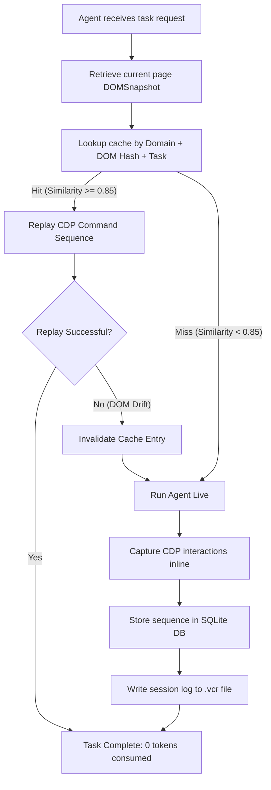

# TERX Execution Workflow

This document details the step-by-step lifecycles of Cache Hits, Cache Misses, and the recording of `.vcr` files.

---

## 🔁 Cache State Lifecycles

TERX runs as a middleware around an agent. When an agent is asked to execute a task, it checks its "muscle memory" first.

---

## 🏃 Run Lifecycle breakdown

### Phase 1: Snapshot and Hash Extraction
Before any agent loop runs, the system takes an accessibility snapshot:
1. **Fetch AX tree:** Hits `Accessibility.getFullAXTree`.
2. **Build Token Stream:** Builds a role sequence string matching `role:label:depth`.
3. **Task normalization:** Creates a task key (e.g. `login to app` $\to$ `b8a5d3f1...`).
4. **Lookup:** Queries the `sequences` database table.

### Phase 2: Cache Hit (Muscle Memory Replay)
When a cached sequence is found:
- **No LLM required:** The agent loop is bypassed.
- **Speed:** CDP commands are dispatched back-to-back down the WebSocket pipe, completing in tens of milliseconds.
- **Verification:** If any click or typing command errors out due to changed DOM boundaries, the replay raises a `CacheReplayError`, terminating early and falling back to live agent control.

### Phase 3: Cache Miss (Agent Recording)
When no sequence matches:
- The context manager enters "recording mode".
- As the live agent runs tool commands (click, type, navigate), the wrapper interceptor captures:
  - CDP command methods and payloads.
  - Returns values from Chromium.
  - Microsecond latency metrics.
- On successful task exit, the recorder commits the sequence to SQLite and serializes the action logs into a JSONL `.vcr` file.
